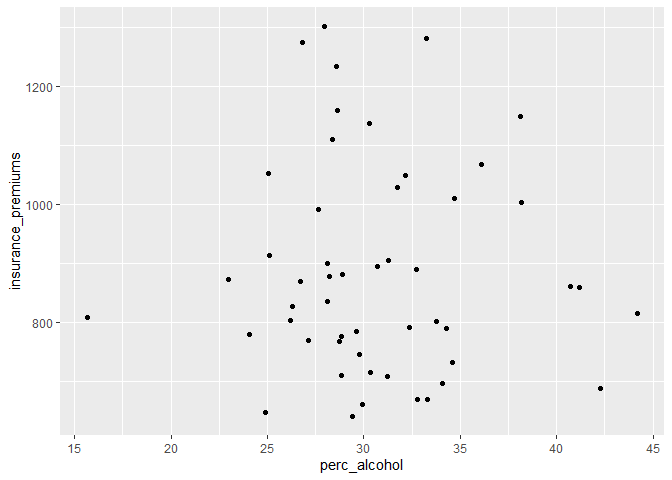
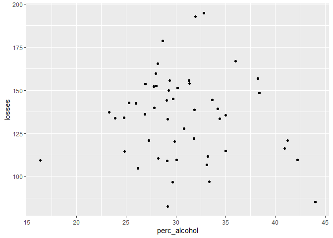
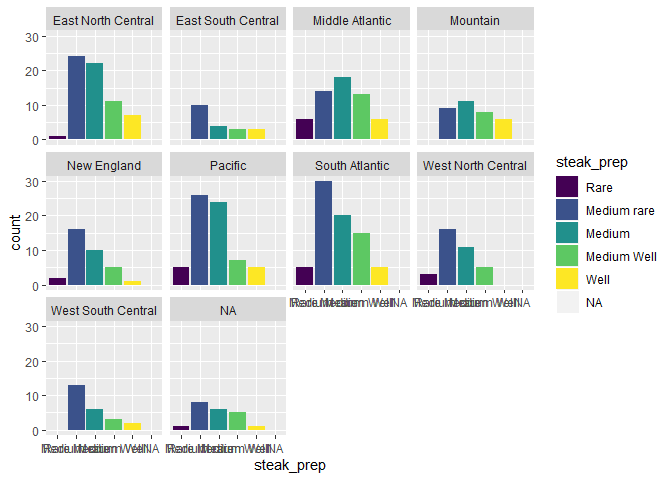
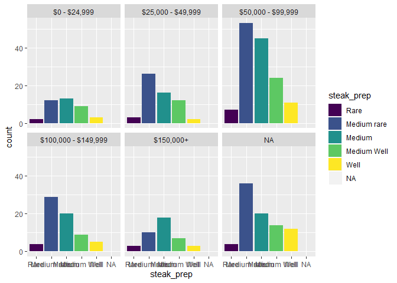
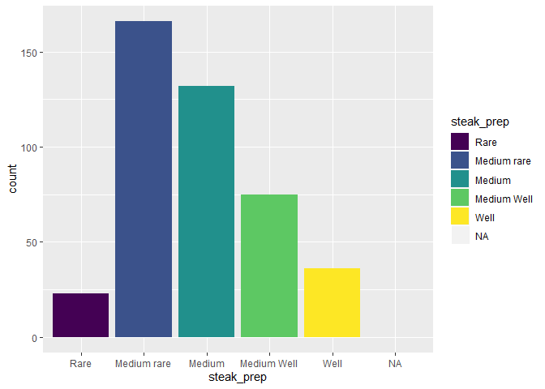

```r
library(tidyverse)
library(fivethirtyeight)
library(dplyr)
```


```r
bad_drivers %>% 
  ggplot() +
  geom_jitter(aes(x = perc_alcohol, y = insurance_premiums))
```

<!-- -->


```r
bad_drivers %>% 
  ggplot() + 
  geom_jitter(aes(x = perc_alcohol, y = losses))
```

<!-- -->


```r
steak_survey %>% 
  ggplot() + 
  geom_bar(aes(x = steak_prep, fill = steak_prep))+
  facet_wrap(~region)
```

<!-- -->


```r
steak_survey %>% 
  ggplot() + 
  geom_bar(aes(x = steak_prep, fill = steak_prep), )+
  facet_wrap(~hhold_income)
```

<!-- -->


```r
steak_survey %>% 
  ggplot() + 
  geom_bar(aes(x = steak_prep, fill = steak_prep) )
```

<!-- -->
